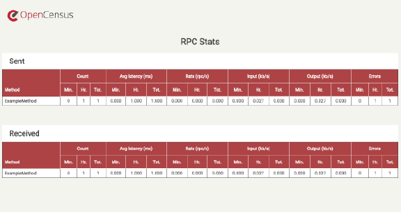
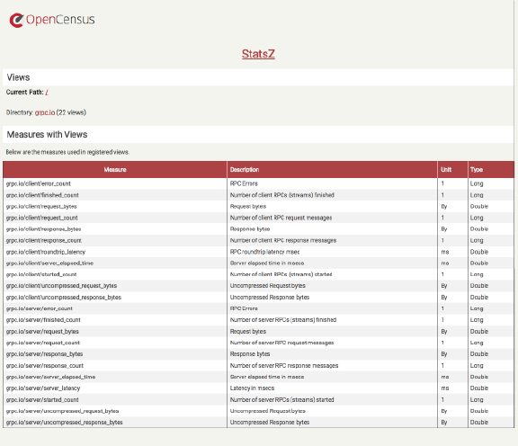
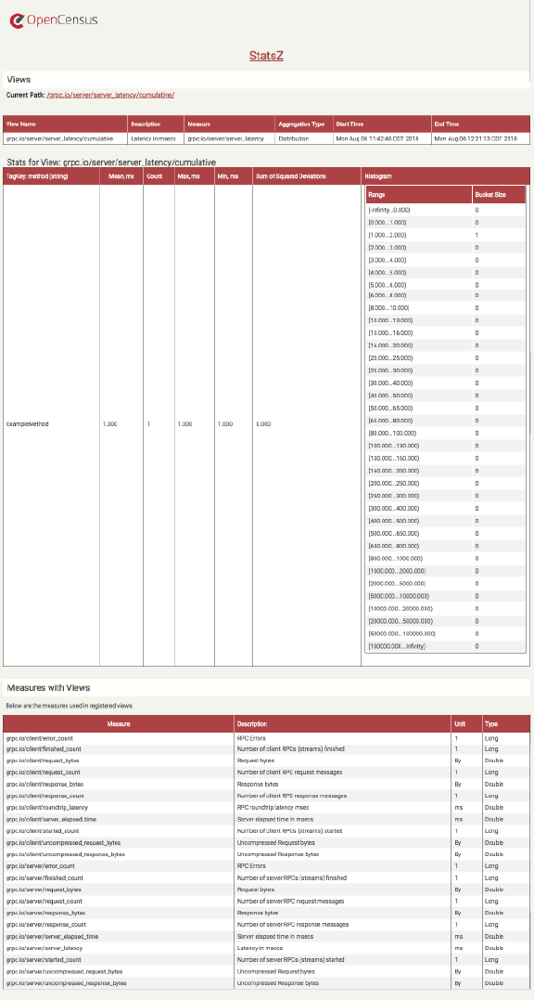
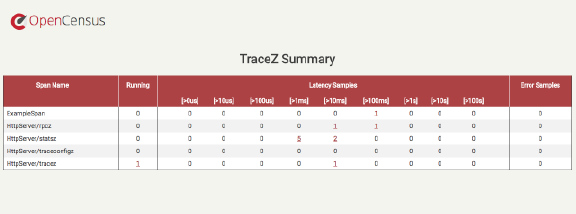
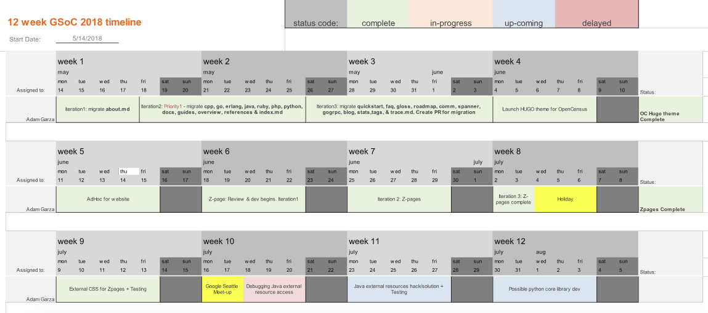

&nbsp; 

<br />

## OpenCensus.io Migration: Hugo Platform Theme (w/Markdown) + ZPages UI Development
### Read the complete GSoC 2018 Proposal - [Here](https://storage.googleapis.com/summerofcode-prod.appspot.com/gsoc/core_project/doc/5184261116657664_1521817377_Proposal_-_OpenCensus.pdf?Expires=1532667013&GoogleAccessId=summerofcode-prod%40appspot.gserviceaccount.com&Signature=7p44Nod2YW8zKeVUVevN1U9QTz5BcF9rzxU%2FKGJEVa%2F6cgJGQhiqe6UhnUIH8K3RiPeNjuWbympVSrGVRdZVK4BhEYRZW3tqpmjzX1%2BkKRiJW54JoOVeW%2B88u4j3xXB6%2B3wsrQV84zkIor4S3yZ2Xcp36lONGqldruMpTkul6%2F5FCyVP6H4o4bpIfGC%2B%2B5z0ccE3X4jpkyDFVaRJ5N8QDs5B1TF9J%2BuR%2FkrOCCTMq6a8%2BT6gBIyrmpONBd8E7OEbOEbP78N5%2BG1QqW1KkvVCoqGrllLdwLNFb%2BjxCpggXyBUhWmEqK7ON3HYK29JP2kxB%2FvuvpJiREE5tQS67LtPfQ%3D%3D) 
<br />

---
 
<br />
### What is OpenCensus?
Application metrics and distributed traces are immensely powerful for developers, but are difficult to automatically retrieve. Based on the same technology used at Google, OpenCensus is an open source project that aims to make the collection and submission of application metrics and traces easier for developers.
It gives developers the tools to track a request as it travels through each of the application services, and it helps gather any metrics of interest.

<br />

---

<br />

## Table of Content

### 1. [Migrate OpenCensus.io into a HUGO markdown theme](#migrate)
 * [1.1 Challenges in Migration](#migrate-challenges)
 * [1.2 Website Migration Commits List](#migrate-commits)
 * [1.3 Migration Pull Requests Merged Authored by Adam Garza](#Mcommits)

### 2. [Develop OpenCensus Zpages UI](#zpages)
 * [2.1 Challenges in Zpages UI](#zpages-challenges)
 * [2.2 Zpages Snapshots](#zpages-snapshots)
 * [2.3 Zpages UI Commits List](#zpages-commits)
 * [2.4 Zpages Pull Requests Merged Authored by Adam Garza](#Zcommits)
 
### 3. [Google Summer of Code 2018 Timeline](#timeline) 
 
### 4. [My GSoC 2018 Keynote Calendar](#calendar)
 
### 5. [Overall Experience](#experience)

### 6. [Final Thoughts](#final)
<br />

---
 
<br />

<a id="migrate"></a>
## 1. Migrate OpenCensus.io into a HUGO markdown theme
The OpenCensus Development Team and Contributors were in need of a fast and easy method to add & update their language specific sections of documentation on the OpenCensus.io website. The use of Markdown would allow them to add new pages and/or edit existing page content in plain text using any text editor. This liberates the developers and the Open Source contributing community from navigating cumbersome Markup modifications, allowing them to focus on the content quality and accuracy.

Part I, of my Proposal was to migrate the existing HTML OpenCensus.io website into a HUGO markdown theme. Prior to GSoC, I have never heard of markdown, much less know anything about the static site generator platform of HUGO. I took this task as a developing challenge and dedicated myself to quickly learn these new platforms and concepts within a short time period. During the bonding stage of the program, I studied every source of information regarding Markdown and the HUGO static site generator platform. The two topics were understandable. Straight out of the box, Hugo and markdown are simple to grasp, work with and implement. The difficulties lay in the conversion of an existing HTML built site into a HUGO platform theme.

<br />

<a id="migrate-challenges"></a>
### 1.1 Challenges in Migration
 At Web Development I'm a wizard, so I thought "Hey, I can do this easily." As I mention earlier, the concept and implementation of the HUGO platform and markdown is easy to understand. The truth is, it took me close to 3 weeks just to capture a good understanding of the HUGO directory structure, and how to implement best practices for the initial implementation to strengthen adaptability & scalability. With the use of heavy JavaScript on the original site, I attempted to use a combination of markdown and shortcode to render the site as close to the original site (HTML, JScript, and CSS).
 
 In order to build the HUGO directory structure, I divided the original site into 2 parts.
 * Theme files & directories (themes directory)
 * Static content files & directories (content, layouts, and static directory)
 
 The `theme` directory will house everything related to the look and feel (template) of the site. The `content, layouts & static` directories will house everything related to the content of the site.

```bash
├── .
├── AUTHORS
├── config.toml
├── content
│   ├── about.md
│   ├── blog.md
│   ├── community.md
│   ├── cpp.md
│   ├── docs.md
│   ├── erlang.md
│   ├── explorer.md
│   ├── faq.md
│   ├── glossary.md
│   ├── go.md
│   ├── gogrpc.md
│   ├── index.md
│   ├── java.md
│   ├── overview.md
│   ├── php.md
│   ├── python.md
│   ├── roadmap.md
│   ├── ruby.md
│   ├── stats.ms
│   ├── tags.md
│   ├── traces.md
│   ├── troubleshooting.md
│   └── zpages.md
├── firebase.JSON
├── layouts
│   └── partials
│       ├── contribute.html
│       ├── footer.html
│       ├── header.html
│       ├── index_nav.html
│       ├── nav.html
│       ├── partners.html
│       ├── statsExporter.html
│       └── traceExporter.html
├── LICENSE
├── README.md
├── static
│   ├── 404.html
│   ├── api
│   │   ├── php
│   │   └── python
│   ├── css
│   │   ├── responsive.css
│   │   └── style.css
│   ├── favicon
│   ├── favicon.ico
│   ├── img
│   ├── index.html
│   ├── js
│   └── sitemap.xml
└── themes
    └── census
        ├── archetypes
        │   └── default.md 
        ├── CHANGELOG.md
        ├── layouts
        │   ├── _default
        │   │   └── single.html
        │   └── shortcodes
        │       ├── go.html
        │       ├── java.html
        │       ├── sc_btn.html
        │       ├── sc_center.html
        │       ├── sc_gloss1.html
        │       ├── sc_indent.html
        │       ├── sc_indent1.html
        │       ├── sc_indent2.html
        │       ├── sc_indent3.html
        │       ├── sc_indent4.html
        │       ├── sc_indent5.html
        │       ├── sc_indent6.html
        │       ├── sc_indent7.html
        │       ├── sc_indent8.html
        │       ├── sc_indent9.html
        │       ├── sc_indent10.html
        │       ├── sc_red.html
        │       ├── sc_supportedExporters.html
        │       ├── sc_supportedLanguages.html
        │       └── snippets.html
        ├── LICENSE.md
        ├── README.md
        └── theme.toml
```

<br />

<a id="migrate-commits"></a>
### 1.2 Website Migration Commits List by Date

Date | Commit Description  |
----------------| --------------------|
May 9, 2018     | [LICENSE and AUTHORS added (#65)](https://github.com/census-instrumentation/opencensus-website/commit/fd1d0a62d653b2fece03190687c2b44487d19ae0) |
May 16, 2018    | [Updated blog posts (#66)](https://github.com/census-instrumentation/opencensus-website/commit/add8c9913cb0c45a7a095c75297543a3ae3b641a) |
May 26, 2018    | [Modified Docs, Overview, Roadmap and created GogRPC (#68)](https://github.com/census-instrumentation/opencensus-website/commit/c212cef05ddc9efadfa821c891dee048ae02241e)|
Jun 4, 2018     | [Initial PR for Hugo theme - markdown (#69)](https://github.com/census-instrumentation/opencensus-website/commit/fd4a91371cb221483db8c75964321f5876f17ed9) |
Jun 6, 2018     | [Updated README, modified docs.md for improved mobile rendering, cleaned shortcodes (#80)](https://github.com/census-instrumentation/opencensus-website/commit/cd66fcf0db2bce8815c873db6853030b967c07e6) |
Jun 8, 2018     | [Optimizing Docs, FAQ & Roadmap pages for mobile (#81)](https://github.com/census-instrumentation/opencensus-website/commit/d9fb4b09c32d844c8c0932edd35380a0c20fc396) |
Jun 11, 2018    | [Added partners/branding + github-corner disappears on mobile view (#84)](https://github.com/census-instrumentation/opencensus-website/commit/81248096613ed386d87349ae36fbdb20f01037b7) |
Jun 12, 2018    | [Landing navbar fix (#85)](https://github.com/census-instrumentation/opencensus-website/commit/4db4c343066ca6d51bbbeb801cf3e8a031da4629) |
Jun 13, 2018    | [Thinned out navbar & shrunk banner height on landing (#89)](https://github.com/census-instrumentation/opencensus-website/commit/6b2d0e69e5f54cda133d213c57db066826c23247) |
Jun 14, 2018    | [Updated README Hugo version and pointing tutorials link to spanner (#90)](https://github.com/census-instrumentation/opencensus-website/commit/da81c9e29fa79a31a99162231bb23d43a7aeb108) |
Jun 14, 2018    | [New Blog entry & some CSS to help (#91)](https://github.com/census-instrumentation/opencensus-website/commit/5380dbf0da4a3659014423cbd894499b2447adbc) |
Jun 16, 2018    | [added new blog entry, and link to the same blog on the overview page (#92)](https://github.com/census-instrumentation/opencensus-website/commit/aea30970c2390826049d62d7705b8588a635fc06) |
Jun 16, 2018    | [Shifted Nic Munroe blog link to top of Overview page (#93)](https://github.com/census-instrumentation/opencensus-website/commit/1b4ee3130c5454da7b01de19339551366dd7f31a) |
Jun 19, 2018    | [Added Ben Ripkens quote to top of Index and removed the last sentence in About - Who is behind OpenCensus (#97)](https://github.com/census-instrumentation/opencensus-website/commit/0ff791409eafa9abe9bf7b8f48e99a04653284a2) |
Jun 19, 2018    | [Dropped Ben Ripkens name down to new line (#98)](https://github.com/census-instrumentation/opencensus-website/commit/fad5343d1b49d66979c770c125d3d192f7231ed7) |
Jul 9, 2018     | [Fixed licensing on the footer to reflect Apache License 2.0 (#163)](https://github.com/census-instrumentation/opencensus-website/commit/06badd9f5d836904d1d7e2e214a5d50e2d32fb17) |
Jul 12, 2018    | [Added Datadog logo to partners & contributors section (#165)](https://github.com/census-instrumentation/opencensus-website/commit/8d807664cffd0dc7486c4aef2883eeded8a84872) |
Jul 13, 2018    | [Updated Who is Behind OC and added Microsoft+Solarwinds to partners section on index, added new blog entry (#168)](https://github.com/census-instrumentation/opencensus-website/commit/64e58db1cec24d6b0e088bdc9b59e39a88e090da) |
Jul 13, 2018    | [Replaced markup with markdown in blog.md (#170)](https://github.com/census-instrumentation/opencensus-website/commit/75a82b1c9590256dfb9bdc4413b8e5b6f19151ab) |
Jul 16, 2018    | [Updated node.js stats as supported on languages table (#177)](https://github.com/census-instrumentation/opencensus-website/commit/701f94daaa6358b9551ab2da40298e8e89bf5a24) |
Jul 19, 2018    | [Included svg images for Stackdriver, Zipkin, Jaeger and Prometheus logos (#181)](https://github.com/census-instrumentation/opencensus-website/commit/90feb88ad200230914748d78c2cea4375af3b31b) |
Jul 19, 2018    | [All partner logos have been replaced with high quality images (#183)](https://github.com/census-instrumentation/opencensus-website/commit/dfa74dcdf237d31f9a31ab3ee01e48601072e42c) |

<a id="Mcommits"></a>
### 1.3 Centralized Pull Requests Merged | authored by Adam Garza found [Here](https://github.com/census-instrumentation/opencensus-website/commits?author=adamgarza)
<br />

---
<br />

<a id="zpages"></a>
## 2. Develop OpenCensus Zpages UI

### What are Zpages?
In OpenCensus, zpages implements a collection of HTML pages that display RPC stats and trace data. My task was to standardize the look and feel of the multiple zpages.
1. Rpcz
2. Statsz
3. Tracez
4. Traceconfigz

To achieve the base UI, I began work on the most complete set of Zpages built in Java. But, since OpenCensus will support multiple languages, I had to also create an external CSS of commonalities among the various zpages to be used across all languages. Basically, we need the zpages for all the supported languages to look and feel the same. To save myself from having to style each of the four zpages for every language supported, a single external CSS can achieve this, as well as, making changes in a single location very accommodating.

<br />

<a id="zpages-challenges"></a>
### 2.1 Challenges in Zpages
Some challenges I came across while working on the Zpages were the unique structures of the numerous tables used among the four Java Zpages.

* RpczZPageHandler.java
* StatszZPageHandler.java
* TracezZPageHandler.java
* TraceConfigzZPageHandler.java

Just as everyone has a distinct hand-writing style, so do programmers. I quickly learned that Open Source Development is a collaborative effort, and every contributor's coding method is different. 

Yet, another challenge I faced while styling the Zpages was how to properly implement an external resource such as a CSS using Gradle to build the resource for availability. As you can see in the snippets of code below, I was able to build the resource with Gradle, and it is available to the rpcz handler. The problem my Java mentor and I came across was determining the relative path for access to the css resource built by Gradle for live production.

Gradle build (build.gradle) lines added:
```
sourceSets.main.resources.srcDirs = [ "src/resources/" ]
sourceSets.main.resources.includes = [ "**/*.css" ]
```

Java rpcz handler lines added (hardcode direct path):
```java
private static final String CSS_PATH =
        "/Users/username/Desktop/opencensus-java" +
        "/contrib/zpages/src/resources/style.css";
```

Java method for reading in the CSS:
```java
private static final String STYLE;
  static {
    String style = "";
    try {
      Reader fileReader = Files.newBufferedReader(Paths.get(CSS_PATH), UTF_8);
      char[] chars = new char[100000000];
      fileReader.read(chars);
      style = String.valueOf(chars);
    } catch (Exception e) {
      e.getMessage();
    }
    STYLE = style;
  }
  ```
<br />

After a week of unsuccessful attempts at linking the Gradle build for external resources such as this CSS, JSON, JavaScript, etc., my Java mentor Yang and I resolved on a work-around. We decided to create a top-level class that hold the CSS as a string (seen below). Since this style class is part of the containing classes package `package io.opencensus.contrib.zpages`, all the Zpage handlers have access to the resource.

Style.java
```java
/* Style.java */
package io.opencensus.contrib.zpages;

final class Style {
  private Style() {}

  static String style =
      "body{font-family: 'Roboto',sans-serif;"
          + "font-size: 14px;background-color: #F2F4EC;}"
          + "h1{color: #3D3D3D;text-align: center;margin-bottom: 20px;}"
          + "p{padding: 0 0.5em;color: #3D3D3D;}"
          + ...
          + ...;
}
```
This now allows the every Zpage handler access to the CSS resource.

RpcZPagehandler
```java
/* RpcZPahehandler.java */
  private static void emitStyles(PrintWriter out, Formatter formatter) {
    out.write("<style>");
    out.write(Style.style);
    out.write("</style>");
  }
```
Each handler now include the CSS resource in the `emitStyles()` method with the addition of `out.write(Style.style);`


The Java access modifiers private and protected cannot be assigned to a class. Only to constructors, methods and fields inside classes. Classes can only have the default (package) and public access modifier assigned to them.

Access Modifiers | private | default | protected | public
---------------- | :-----: | :-----: | :-------: | :----:
Inside Class | Y | Y | Y | Y
Same Package Class | N | Y | Y | Y
Same Package Sub-Class | N | Y | Y | Y
Other Package Class | N | N | N | Y
Other Package Sub-Class | N | N | Y | Y

<br />

<a id="zpages-snapshots"></a>
### 2.2 Zpages Snapshots

**rpczZPageHandler.java**  
*Landing page*
[](img/rpcZPage.png)

**StatszZPageHandler.java**  
*Stats landing page*
[](img/statsZPage1.png)

**StatszZPageHandler.java**  
*Stats view grpc.io/server/server_latency/cumulative page*
[](img/statsZPage2.png)
  
**TracezZPageHandler.java**  
*Landing page*
[](img/traceZPage.png)

*TraceconfigzZPageHandler.java**  
*Landing page*
[](img/traceconfigZPage.png)


<br />

<a id="zpages-commits"></a>
### 2.3 Zpage UI Commits List by Date

Date | Commit Description  |
----------------| --------------------|
Jun 10, 2018    | [Rpcz, Statsz, Tracez, and Traceconfigz page styling modifications (#1295)](https://github.com/census-instrumentation/opencensus-java/commit/2d1e5c8486bbb5f1101a057d7e044dc60f80a50d)
Jul 24, 2018    | [Zpages external CSS added and gradle modified to include this resource (#1341)](https://github.com/census-instrumentation/opencensus-java/commit/53fc5f0e49eab37fc814f38b11352c9b19e83fe1)
Jul 31, 2018    | [Top-level style class added for Zpages use + Final commit for GSoC... (#1351)](https://github.com/census-instrumentation/opencensus-java/pull/1351)

<a id="Zcommits"></a>
### 2.4 Centralized Pull Requests Merged | authored by Adam Garza found [Here](https://github.com/census-instrumentation/opencensus-java/commits?author=adamgarza)
<br />

---
<br />

<a id="timeline"></a>
## 3. Google Summer of Code 2018 Timeline

Date | Event |
---- | ----- |
Jan 4 |	Mentoring organizations can begin submitting applications to Google |
Jan 23 | Mentoring organization application deadline |
Jan 23 - Feb 11 |	Google program administrators review organization applications |
Feb 12 | List of accepted mentoring organizations published |
Feb 12 - Mar 12 |	Potential student participants discuss application ideas with mentoring organizations |
Mar 12 | Student application period begins |
Mar 27 | Student application deadline |
Apr 23 | Accepted student proposals announced |
Apr 23 - May 14 | Community Bonding Period	Students get to know mentors, read documentation, get up to speed to begin working on their projects |
May 14 | Coding officially begins! |
Jun 11 | Mentors and students can begin submitting Phase 1 evaluations |
Jun 15 | Phase 1 Evaluation deadline |
Jun 15 - Jul 9 | Work Period	Students work on their project with guidance from Mentors |
Jul 9 | Mentors and students can begin submitting Phase 2 evaluations |
Jul 13 | Phase 2 Evaluation deadline  |
Jul 13 - Aug 6 | Work Period	Students continue working on their project with guidance from Mentors |
Aug 6 - 14 | Final week: Students submit their final work product and their final mentor evaluation |
Aug 14 - Aug 21 | Mentors submit final student evaluations |
Aug 22 | Final results of Google Summer of Code 2018 announced |
Oct | Mentor Summit at Google |

<br />

---
<br />

<a id="calendar"></a>
## 4. My GSoC 2018 Keynote Calendar
[](https://drive.google.com/file/d/19jQN7CWXROzLMPoG6ExJF2z3PIa9NCUo/view?usp=sharing)

1. Week 1 (May 14 - May 18)
* Iteration 1 of migration
* Convert about.html to about.md
* Migrate the page seamlessly 

2. Week 2 (May 21 - May 25)
* Iteration 2 of migration
* Convert currently supported languages
  * cpp
  * go
  * erlang
  * java
  * php
  * python
  * ruby
* Convertion priority of pages [W2]
  * index
  * docs
  * guides
  * overview
  * reference

3. Week 3 (May 28 - Jun 1)
* Iteration 3 of migration
* Meet w/mentor Yaana Burcu Dogan [Developers' group]
* Convertion priority of pages [W3]
  * quickstart
  * faq
  * glossary
  * roadmap
  * community
  * spanner
  * gogrpc
  * blog
  * stats
  * tags
  * trace
* Commit changes

4. Week 4 (Jun 4 - Jun 8)
* Add Partners to website
* Scrub the code
* Commit changes
* Create Pull Request
* Migrate to Hugo SSG in markdown

5. Week 5 (Jun 11 - Jun 15)
* Ad hoc the website as requested
* Optimize Census theme for adaptability
* Optimize site for mobile
* Include new blog entries

6. Week 6 (Jun 18 - Jun 22)
* Zpages research and discovery
* Meet w/mentor Yang Song [Java group]
* Iteration 1 - Draft template

7. Week 7 (Jun 25 - Jun 29)
* Inline styling
* Iteration 2 submitted for review
  * rpcZPageHandler.java
  * statsZPageHandler.java

8. Week 8 (Jul 2 - Jul 6)
* Inline styling
* Iteration 3 submitted for review
  * traceZPageHandler.java
  * traceconfigZPageHandler.java
* Independence Day Holiday

9. Week 9 (Jul 9 - Jul 13)
* Create external CSS for Zpages to be used across languages
* Test accessability of external CSS for Zpages
* Review and complete website's backlog of items
* Update licensing
* Convert blog to complete markdown

10. Week 10 (Jul 16 - Jul 20)
* Debug Java external resource path issue
* Debug Gradle build resource accessability issue

11. Week 11 (Jul 23 - Jul 27)
* Implement Java external resources solution
  * Top-level private class for CSS
  * Lives within the same package class as the handlers
* Unify the element classes and IDs across all Zpages 

12. Week 12 (Jul 30 - Aug 3)
* Test solution across all Zpages
* Scrub the code
* Commit changes
* Create Pull Request

<br />

---
<br />
<a id="experience"></a>
## 5. Overall Experience 
Prior to my participation in Google Summer of Code 2018, I had no experience with and in some cases have never heard of the platforms, programs or concepts used in Open Source Development. Things like Markdown, HUGO platform, Git and Github, and collaborative development were all foreign to me. Knowing that I might struggle throughout much of this summer program, I chose to dive into it... as an effort to breakout of my comfort zone and commit myself to learn and adapt.

The first few weeks of communicating and interacting with the managers, developers and collaborators of OpenCensus was intimidating for me, to say the least. But as I continued moving forward in the program - within my contact with everyone at OpenCensus, I never felt uncomfortable asking questions or explanations.

My overall experience participating in the Google Summer of Code 2018 on OpenCensus was one of learning. GSoC has allowed me to strengthen the following skills:
* Communication - specifically the ability to write and speak effectively and professionally
* Collaboration
* Time Management
* Adaptability
* Critical Thinking
* Research and Analysis
* Initiative

<br />

---
<br />

<a id="final"></a>
## 6. Final Thoughts
I'm not much of a writer, but I will try to make this as eloquent as possible. Knowing this program is an enormous opportunity for me as a green developer, I placed an overwhelming amount of pressure upon myself to achieve. Although, what I lack in "know how", I more than make up for in determination. These 12 weeks have been stressful and challenging, yet satisfying and rewarding with the sense of accomplishment for sure.

I would like to thank my mentor Gopi Palaniappan for this opportunity. From the very start you have been my #1 supporter, having all the confidence in me to perform well. Many times we do not know how much of an impact we have on those around us. I will like to let you know, that you have made an enormous impact and influence on what I do, and where I go from here. Thank you for all the support.

I will also take this moment to thank Pritam Shah, for the help me plan and execute a comprehensive work plan. Jaana Burcu Dogan, thank you for helping me manage the issues with the site. Yang Song, thank you for the guidance, when I came across an issue that I could not resolve solo.

>The generations of family members that have come before me have made great sacrifices in order for me to have the opportunities I have right now. There is no better way to repay their sacrifices, than to achieve when those opportunities are presented. My hope is that I somehow make things better for those who will follow.

\- Adam Garza